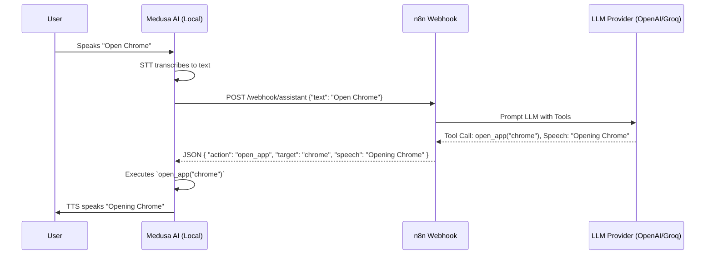

# Architecture Overview

Medusa AI employs a decoupled, event-driven architecture designed to separate local sensory input/output (Voice, App Execution) from heavy cognitive processing (NLP, LLMs).

## The "Dumb Client -> Smart Brain" Paradigm

Instead of running massive LLMs or complex NLP libraries on your local hardware, the Python application is treated strictly as an I/O client. 

1. **Ears (STT)**: Listens to your voice and transcribes it into text.
2. **Nervous System (HTTP Client)**: Sends the text via a POST request to a remote server (n8n).
3. **Brain (n8n Workflow)**: Receives the text, maintains conversational memory, prompts an LLM, decides if an action needs to be taken, and returns a JSON response.
4. **Mouth (TTS)**: Reads the text response aloud.
5. **Hands (Execution)**: Performs any local OS commands (like opening an app) dictated by the brain.

### Data Flow Diagram

## Processing Pipeline

### 1. Voice Input Pipeline (`stt.py`)
Relies on `SpeechRecognition` to capture audio from the default microphone, calibrate for ambient noise, and use Google's Web Speech API for transcription.

### 2. Network Pipeline (`n8n_client.py`)
Packages the transcribed text along with system context (timestamp, OS) and sends it. Crucially, this layer is protected by robust retry decorators and exponential backoff to handle network unreliability.

### 3. Response Generation Flow (n8n)
The n8n workflow parses the incoming webhook, routes the text into an AI Agent node equipped with memory, and returns a strictly formatted JSON object dictating the assistant's next move.

### 4. Voice Output Pipeline (`tts.py`)
Uses `edge-tts` to generate highly realistic speech audio, saves it to a temporary `.mp3` file, and uses `pygame.mixer` to play it asynchronously without blocking the main loop.

### 5. Local Execution Flow (`Dictapp.py`)
If the n8n JSON contains an `action` and `target`, this module resolves the target (e.g., "chrome") to a system executable (e.g., `chrome.exe`) and launches or kills it using `os.system`.

## Error Handling Flow

The architecture is designed to fail gracefully:
- **STT Failure**: Caught and ignored. The loop continues listening.
- **Network Failure**: Retried up to 3 times. If it still fails, a custom `NetworkCommunicationError` is raised, and the user is verbally informed that the connection is down.
- **TTS Failure**: Caught and logged. The system will not crash, but audio output will be skipped.
- **Configuration Failure**: Hard crash on startup. The system validates itself before entering the continuous loop.
